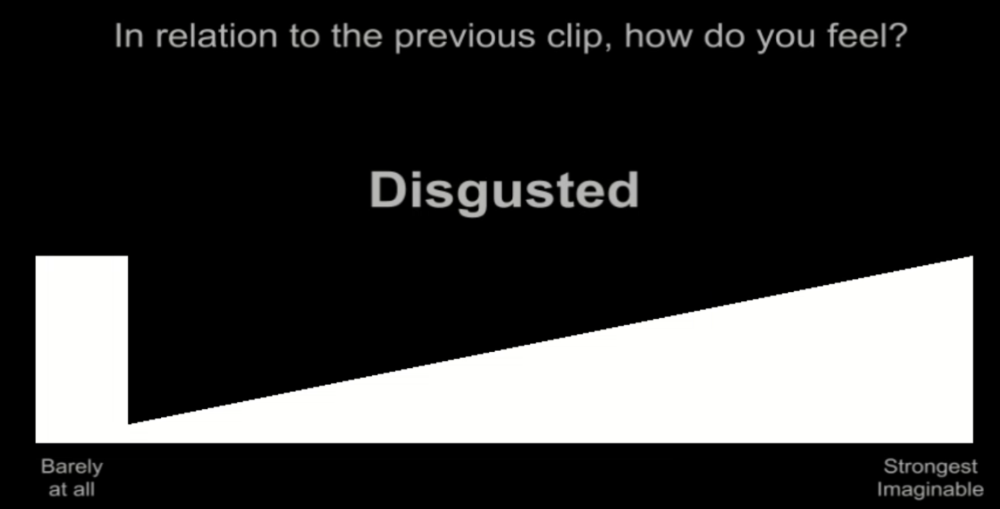

# alignvideo
### Purpose
This purpose of the alignvideo task is to have participants watch nearly 90 minutes of videos that vary in content.
The videos include scenes intended to feature various kinds of empathic states, appetitive states, aversive states, social relationships, 
scenescapes (e.g. mountains, oceans/beaches, outer space, urban/rural, natural disasters), animals, body parts,
emotions, narratives, spoken languages, humor, music, sports, and organism/environment interactions. The neural data collected
while participants view these videos can be used to test the efficacy of functional alignment methods.

Because all participants view these videos in addition to completing the pain, emotion, and cognitive control tasks in the 
spatial topology studyverse, these videos serve as training data that can be used to align neural data across participants. 

### Paradigm
In this task, participants view one video at a time. After each video they make a series of ratings about how the video made
them feel. There are 7 separate ratings:
1. Personal Relevance
2. Happy
3. Sad
4. Afraid
5. Disgusted
6. Warm and Tender
7. Engaged

Participants have 5 seconds to make each of the 7 ratings. 

For each rating, the phrase "In relation to the previous video, how do you feel?" is presented, followed by 1 of the 7 keywords.
A triangle is drawn across the screen with the anchors "barely at all" on the left-most side and "strongest imagineable" on the
right-most side. Participants use a trackball in the scanner to slide left-to-right across the screen to designate how strongly
they felt each of the dimensions of interest. For example, in the image below the participant is indicating that they felt 
a low level of disgust during the video they just viewed:

### Running the Code
To do
### Folder Structure and Description
To do
